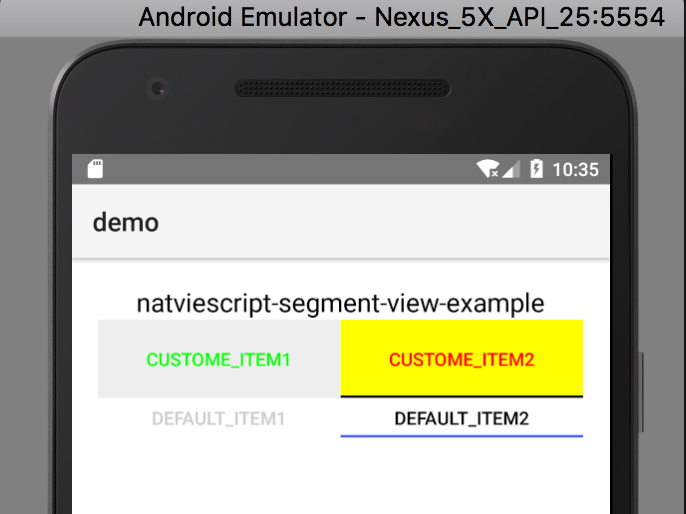
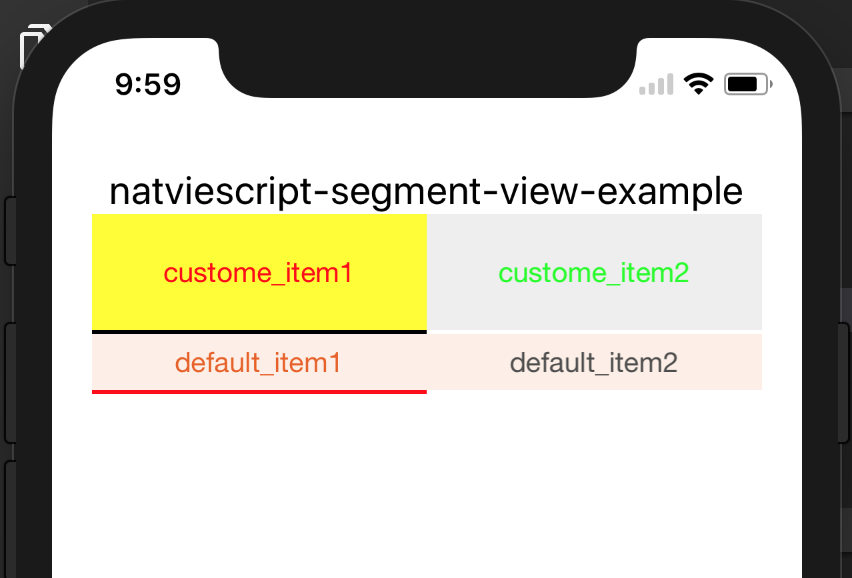

# nativescript-segment-view

A NativeScript plugin to extend segmentBar, make style same in android and ios.

## Sample Screenshots

#### Android

Sample 1
--------



#### iOS

Sample 1
--------



## Installation

```javascript
tns plugin add nativescript-segment-view
```

## Usage 

### XML
```XML
<Page xmlns="http://schemas.nativescript.org/tns.xsd" loaded="pageLoaded" class="page"
  xmlns:ui="nativescript-segment-view">
  <StackLayout class="p-20">
    <Label text="{{ message }}" class="t-20 text-center c-black" textWrap="true"/>
    <ui:n-s-segment-view id="1" items="{{tabItems}}" height="60" selectedIndexChanged="selectedIndexChanged"
      style="seg-background-color:#EEE;selected-background-color:#FF0;line-color:#000;selected-color:#F00;title-color:#0F0;"></ui:n-s-segment-view>
      <ui:n-s-segment-view id="2" items="{{tabItems2}}" height="30" selectedIndexChanged="selectedIndexChanged"></ui:n-s-segment-view>
  </StackLayout>
</Page>
```
### TS
```TS
import { Observable } from 'tns-core-modules/data/observable';
import { NSSegmentView, NSSegmentViewItem } from 'nativescript-segment-view';

export class HelloWorldModel extends Observable {
  public message: string;
  private segmentView: NSSegmentView;
  private tabItems: NSSegmentViewItem[];
  private tabItems2: NSSegmentViewItem[];

  constructor() {
    super();

    // this.segmentView = new NSSegmentView();
    this.message = "examples";
    this.tabItems = [];
    const item1 = new NSSegmentViewItem();
    item1.title = 'custom_item1';
    this.tabItems.push(item1);
    const item2 = new NSSegmentViewItem();
    item2.title = 'custom_item2';
    this.tabItems.push(item2);

    this.tabItems2 = [];
    const item21 = new NSSegmentViewItem();
    item21.title = 'default_item1';
    this.tabItems2.push(item21);
    const item22 = new NSSegmentViewItem();
    item22.title = 'default_item2';
    this.tabItems2.push(item22);
  }
}
```

## Angular NativeScript

```TS
import * as elementRegistryModule from 'nativescript-angular/element-registry';
elementRegistryModule.registerElement("NSSegmentView", () => require("nativescript-segment-view").NSSegmentView);
```

```XML
<NSSegmentView id="1" (loaded)="onLoad()" [items]="tabItems" height="60" (selectedIndexChange)="onSelectedIndexChange($event)"
    style="seg-background-color:#EEE;selected-background-color:#FF0;line-color:#000;selected-color:#F00;title-color:#0F0;"></NSSegmentView>
```
    
## License

MIT License
